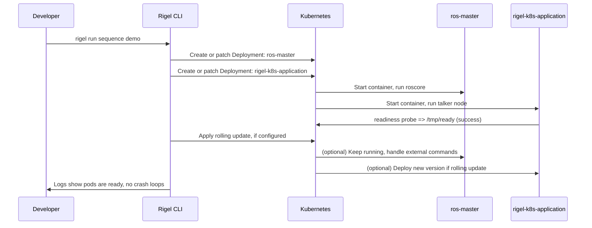

# Kubernetes Orchestration Plugin for Rigel

This is the repository for a Rigel plugin that orchestrates ROS applications on Kubernetes. It includes:

- Automatic ROS Master deployment on K8s for multi-node communication
- Main ROS application container deployment using a pre-built Docker image
- Automatic readiness checks
- Persistent storage via K8s Persistent Volumes
- Rolling updates and optional distributed deployment
- Pre-configured observability tools (Promtail, Loki, Prometheus, Grafana)

## Development Setup

At first, clone the repository and install `rigel` directly at root level with the following command (keep in mind the git branch to be used):

```bash
pip install git+https://github.com/rigel-ros/rigel@develop
```

## Requirements

- A running Kubernetes cluster (e.g., [Minikube](https://minikube.sigs.k8s.io/docs/), [kind](https://kind.sigs.k8s.io/), or a cloud provider).
- A **pre-built ROS Docker image** (if you follow the example in this repo, we use `ros:noetic-ros-core` or a custom image that starts `roscore` plus a simple talker node).

## Quick Start

1. **Build or pull** a Docker image that includes:
   - ROS environment (e.g., `ros:noetic-ros-base` or `ros:noetic-ros-core`).
   - Your custom nodes or a simple talker/echo script.

2. **Push** the image to a registry accessible by your cluster (e.g., Docker Hub).

3. **Edit** the `Rigelfile` according to your image and application requirements.

4. **Run** the sequence to deploy:
   ```bash
   rigel run sequence demo
   ```

5. **Check** the pods:
   ```bash
   kubectl get pods
   kubectl logs deployment/ros-master
   kubectl logs deployment/rigel-k8s-application
   ```

6. **Debug** if needed:
   - `kubectl exec -it <pod> -- bash`
   - `rostopic list`, `rosnode list`, etc.

You should see a `ros-master` Deployment and a `rigel-k8s-application` Deployment come up. If `readiness` passes, your pods will be marked “1/1 Running.”

## Architecture Overview

1. **OrchestrationPlugin**: Creates/updates K8s resources (Deployments, PV/PVC) based on your Rigelfile.
2. **ROS Master**: Deployed as one container that runs `roscore`.
3. **Main App**: Another container (your pre-built image) that connects to the ROS Master. Uses `/tmp/ready` for readiness if needed.
4. **Observability**: A job for setting up Prometheus, Loki, etc.
5. **Rolling Updates**: If you provide updated images or deployment patches, the plugin can handle them gracefully (zero downtime) if readiness probes succeed.


